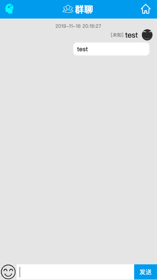
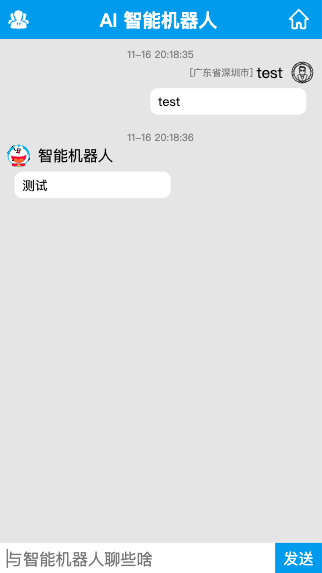

# 智能聊天系统

## 目录

- 需求说明
- 安装教程
- 相关接口
- 数据库设计
- 技术栈
- 运行效果

### 一、需求说明

#### 1.1 需求背景

提高人与人之间交流，节约客户人力成本。

#### 1.2 需求内容

- 用户登录
- 用户注册
- 文件上件
- 密码修改
- 群聊
- AI 智能聊
- 发送消息
- 获取联系人历史消息

### 二、安装教程

- 环境准备
- 如何运行
- 项目配置

#### 2.1 环境准备

要运行**智能聊天系统**，你需要`Node.js(V10 LTS版本，例如10.6.3)`开发环境和`MySql`数据库

- 安装 Node.js
  - 官网[http://nodejs.cn/download/](http://nodejs.cn/download/)
  - 更推荐使用 nvm 安装 Node.js
    - 安装 nvm
    - 通过 nvm 安装 Node.js
- 安装 MySql

推荐在 Linux 和 MacOS 系统中运行，Windows 系统也兼容的，但是遇到意外问题会多一些

#### 2.2 如何运行

- 客户端访问
- 服务器运行步骤
- nginx 反向代理配置

**客户端运行说明**

访问地址：[http://chat.xiaowuzi.info](http://chat.xiaowuzi.info)

> 请使用 IE8 以上浏览访问或手机访问

**服务器运行步骤**

> 进行项目——>运行`npm install`——>启动后端服务`npm run server`——>启动前端

**nginx 反向代理配置**

```
server {
   listen 80;
   # 修改为你的域名
   server_name chat.xiaowuzi.info;

   location / {
      proxy_set_header   X-Real-IP        $remote_addr;
      proxy_set_header   X-Forwarded-For  $proxy_add_x_forwarded_for;
      proxy_set_header   Host             $http_host;
      proxy_set_header   Upgrade          $http_upgrade;
      proxy_set_header   X-NginX-Proxy    true;
      proxy_set_header   Connection "upgrade";
      proxy_http_version 1.1;
      # 路径重写
		rewrite  /api/(.*)  /$1  break;
      proxy_pass         http://localhost:9090;
   }
}
```

**配置 HTTPS+HTTP2.0**

```
server {
   listen 80;
   # 修改为你的域名
   server_name chat.xiaowuzi.info;
   return 301 https://chat.xiaowuzi.info$request_uri;
}
server {
   listen 443 ssl http2;
   # 修改为你的域名
   server_name chat.xiaowuzi.info;

   ssl on;
   # 修改为你的ssl证书位置
   ssl_certificate ./ssl/chat.xiaowuzi.info.crt;
   ssl_certificate_key ./ssl/chat.xiaowuzi.info.key;
   ssl_session_timeout 5m;
   ssl_protocols TLSv1 TLSv1.1 TLSv1.2;
   ssl_ciphers ECDHE-RSA-AES128-GCM-SHA256:HIGH:!aNULL:!MD5:!RC4:!DHE;
   ssl_prefer_server_ciphers on;

  root /data/www/chat;

   location /api {
      proxy_set_header   X-Real-IP        $remote_addr;
      proxy_set_header   X-Forwarded-For  $proxy_add_x_forwarded_for;
      proxy_set_header   Host             $http_host;
      proxy_set_header   Upgrade          $http_upgrade;
      proxy_set_header   X-NginX-Proxy    true;
      proxy_set_header   Connection "upgrade";
      proxy_http_version 1.1;
      # 路径重写
		rewrite  /api/(.*)  /$1  break;
      proxy_pass         http://localhost:9090;
   }
}
```

#### 2.3 项目配置

- 服务配置 `config/server.js`
- 客户端配置 `config/client.js`
- 客户端构建配置 `webpack.js`

### 三、相关接口

#### 3.1 注册

- 请求地址：`/api/reg`
- 请求类型：`POST`
- 请求参数

| 参数名称 | 是否必须 | 示例          | 备注     |
| -------- | -------- | ------------- | -------- |
| nick     | 是       | tony          | 登录名   |
| password | 是       | 123456        | 登录密码 |
| email    | 是       | 123456@qq.com | 邮箱     |
| name     | 是       | 小武子        | 真实姓名 |

- 返回数据

| 名称 | 类型   | 是否必须 | 默认值        | 备注                     |
| ---- | ------ | -------- | ------------- | ------------------------ |
| code | number | 必须     | 0             | 0 表示成功，其它值为出错 |
| data | object | 必须     | {id:20191116} | 略                       |
| msg  | string | 必须     |               | 略                       |

#### 3.2 登录

- 请求地址：`/api/login`
- 请求类型：`POST`
- 请求参数

| 参数名称 | 是否必须 | 示例   | 备注   |
| -------- | -------- | ------ | ------ |
| username | 是       | fftony | 登录名 |
| password | 是       | 123456 | 密码   |

- 返回数据

| 名称 | 类型   | 是否必须 | 默认值 | 备注                     |
| ---- | ------ | -------- | ------ | ------------------------ |
| code | number | 必须     | 0      | 0 表示成功，其它值为出错 |
| data | object | 必须     | {}     | 略                       |
| msg  | string | 必须     |        | 略                       |

#### 3.3 添加好友

- 请求地址：`/api/add-friend`
- 请求类型：`POST`
- 请求参数

| 参数名称 | 是否必须 | 示例     | 备注    |
| -------- | -------- | -------- | ------- |
| userId   | 是       | 20191117 | 用户 id |

- 返回数据

| 名称 | 类型   | 是否必须 | 默认值        | 备注                     |
| ---- | ------ | -------- | ------------- | ------------------------ |
| code | number | 必须     | 0             | 0 表示成功，其它值为出错 |
| data | object | 必须     | {id:20191116} | 略                       |
| msg  | string | 必须     |               | 略                       |

#### 3.4 删除好友

- 请求地址：`/api/del-friend`
- 请求类型：`POST`
- 请求参数

| 参数名称 | 是否必须 | 示例     | 备注    |
| -------- | -------- | -------- | ------- |
| userId   | 是       | 20191117 | 用户 id |

- 返回数据

| 名称 | 类型   | 是否必须 | 默认值        | 备注                     |
| ---- | ------ | -------- | ------------- | ------------------------ |
| code | number | 必须     | 0             | 0 表示成功，其它值为出错 |
| data | object | 必须     | {id:20191116} | 略                       |
| msg  | string | 必须     |               | 略                       |

#### 3.5 修改密码

- 请求地址：`/api/update-password`
- 请求类型：`POST`
- 请求参数

| 参数名称    | 是否必须 | 示例     | 备注    |
| ----------- | -------- | -------- | ------- |
| userId      | 是       | 20191117 | 用户 id |
| oldPassword | 是       | 123456   | 旧密码  |
| newPassword | 是       | 123456   | 新密码  |

- 返回数据

| 名称 | 类型   | 是否必须 | 默认值        | 备注                     |
| ---- | ------ | -------- | ------------- | ------------------------ |
| code | number | 必须     | 0             | 0 表示成功，其它值为出错 |
| data | object | 必须     | {id:20191116} | 略                       |
| msg  | string | 必须     |               | 略                       |

#### 3.6 修改用户名

- 请求地址：`/api/change-username`
- 请求类型：`POST`
- 请求参数

| 参数名称 | 是否必须 | 示例     | 备注    |
| -------- | -------- | -------- | ------- |
| username | 是       | tony     | 用户名  |
| userId   | 是       | 20191117 | 用户 id |

- 返回数据

| 名称 | 类型   | 是否必须 | 默认值        | 备注                     |
| ---- | ------ | -------- | ------------- | ------------------------ |
| code | number | 必须     | 0             | 0 表示成功，其它值为出错 |
| data | object | 必须     | {id:20191116} | 略                       |
| msg  | string | 必须     |               | 略                       |

#### 3.7 摘取用户列表

- 请求地址：`/api/get-user-list`
- 请求类型：`GET`
- 请求参数

| 参数名称 | 是否必须 | 示例 | 备注   |
| -------- | -------- | ---- | ------ |
| page     | 是       | 1    | 当前页 |
| size     | 是       | 10   | 页大小 |

- 返回数据

| 名称 | 类型   | 是否必须 | 默认值        | 备注                     |
| ---- | ------ | -------- | ------------- | ------------------------ |
| code | number | 必须     | 0             | 0 表示成功，其它值为出错 |
| data | object | 必须     | {id:20191116} | 略                       |
| msg  | string | 必须     |               | 略                       |

#### 3.8 发送消息

- 请求地址：`/api/send-msg`
- 请求类型：`POST`
- 请求参数

| 参数名称 | 是否必须 | 示例     | 备注      |
| -------- | -------- | -------- | --------- |
| userId   | 是       | 20191117 | 发送人 id |
| msg      | 是       | '你大爷' | 消息内容  |

- 返回数据

| 名称 | 类型   | 是否必须 | 默认值        | 备注                     |
| ---- | ------ | -------- | ------------- | ------------------------ |
| code | number | 必须     | 0             | 0 表示成功，其它值为出错 |
| data | object | 必须     | {id:20191116} | 略                       |
| msg  | string | 必须     |               | 略                       |

#### 3.9 获取联系人历史消息

- 请求地址：`/api/msg-history`
- 请求类型：`GET`
- 请求参数

| 参数名称   | 是否必须 | 示例     | 备注         |
| ---------- | -------- | -------- | ------------ |
| linkmanId  | 是       | 20191117 | 联系人 id    |
| existCount | 是       | 13       | 已有消息数量 |

- 返回数据

| 名称 | 类型   | 是否必须 | 默认值        | 备注                     |
| ---- | ------ | -------- | ------------- | ------------------------ |
| code | number | 必须     | 0             | 0 表示成功，其它值为出错 |
| data | object | 必须     | {id:20191116} | 略                       |
| msg  | string | 必须     |               | 略                       |

#### 3.10 智能接口（调用图灵机器人）

- 请求地址：`/api/chatting-ai`
- 请求类型：`POST`
- 请求参数

| 参数名称 | 是否必须 | 示例     | 备注       |
| -------- | -------- | -------- | ---------- |
| userid   | 是       | 你大爷   | 20191117   |
| msg      | 是       | 消息内容 | 做的很好呀 |

- 返回数据

| 名称 | 类型   | 是否必须 | 默认值        | 备注                     |
| ---- | ------ | -------- | ------------- | ------------------------ |
| code | number | 必须     | 0             | 0 表示成功，其它值为出错 |
| data | object | 必须     | {id:20191116} | 略                       |
| msg  | string | 必须     |               | 略                       |

### 四、数据库设计

#### 4.1 用户表

**创建语句**

```
CREATE TABLE   IF NOT EXISTS  `user` (
  `id` int(11) NOT NULL AUTO_INCREMENT,
  `email` varchar(255) DEFAULT NULL,
  `password` varchar(255) DEFAULT NULL,
  `name` varchar(255) DEFAULT NULL,
  `nick` varchar(255) DEFAULT NULL,
  `detail_info` json DEFAULT NULL,
  `create_time` varchar(20) DEFAULT NULL,
  `modified_time` varchar(20) DEFAULT NULL,
  `level` int(11) DEFAULT NULL,
  PRIMARY KEY (`id`)
) ENGINE=InnoDB DEFAULT CHARSET=utf8;
```

### 五、技术栈

- **Vue 2.6**：前端页面展示
- **Socket.io**：实现实时通信
- **Vuex**：Vuex，实现不同组件间的状态共享
- **Vue-router**：页面路由切换
- **axios**：一个基于`Promise`的 HTTP 库，向后端发起请求。
- **Koa2**：一个`node.js`web 应用框架
- **Monment.js**：一个时间处理的库，方便对时间进行格式化成需要的格式。
- **ES6、ES7**：采用 ES6 语法，箭头函数、`Promise`等等语法很好用。
- **MySql**：开源数据库
- **Webpack**：前端打包工具。
- **SASS(SCSS)**：用 SCSS 做 CSS 预处理语言，有些地方很方便。
- **flex**：flex 弹性布局，简单适配手机、PC 端。
- **CSS3**：CSS3 过渡动画及样式。

### 六、运行效果

#### 6.1 登录页面


#### 6.2 群聊页面



#### 6.3 智能聊天页面



### 联系我

- 关于我：[https://xiaowuzi.info](https://xiaowuzi.info)
- github：[https://github.com/fttony](https://github.com/fttony)
- Email：172993974@qq.com

### 参考资料

- [Node.js 文档](https://nodejs.org/docs/latest-v11.x/api/)
- [Koa 文档](https://koajs.com/)
- [Sockit.io 文档](https://socket.io/)
- [Vue.js 文档](https://vuejs.org/)
